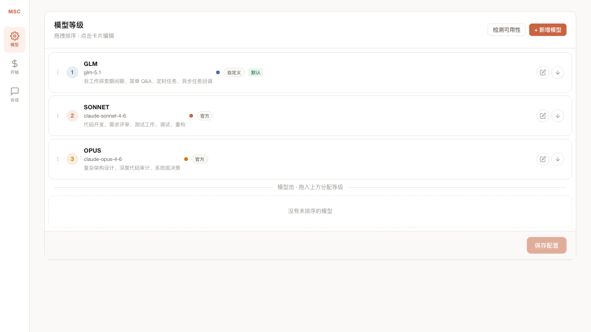
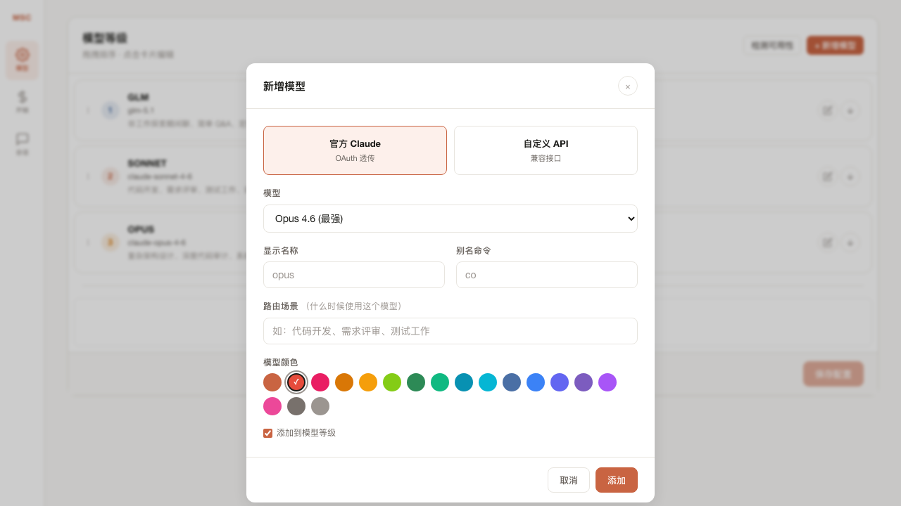
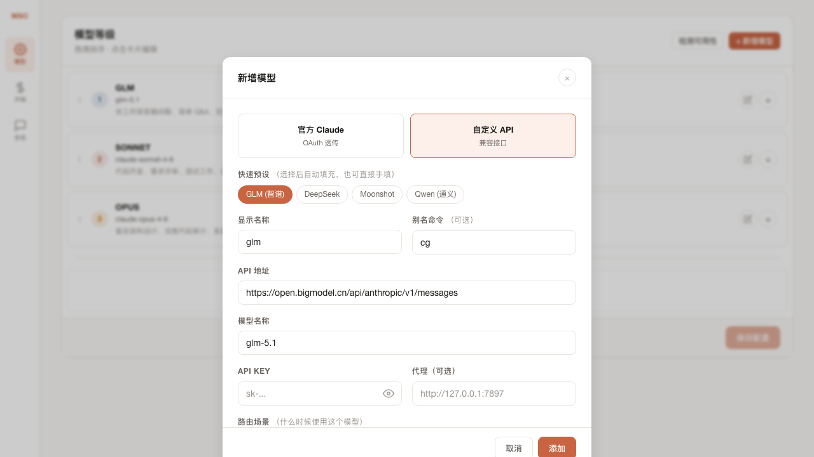
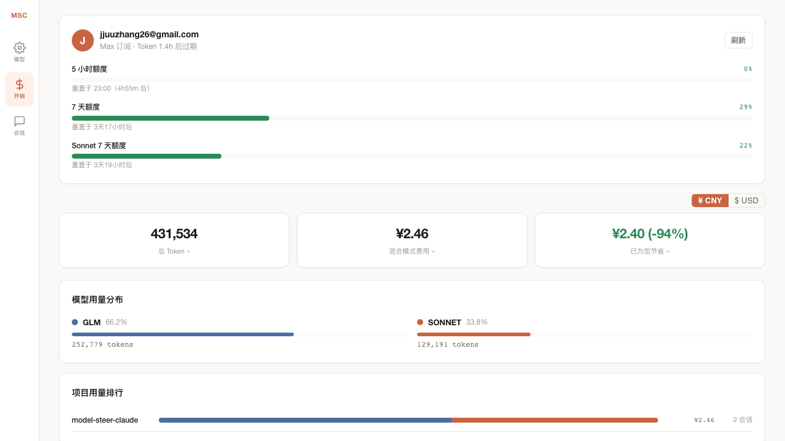

<p align="center">
  
  <h1 align="center">Model Steer Claude (MSC)</h1>
  <p align="center">
    <strong>让 Claude Code 自己掌舵</strong>
  </p>
  <p align="center">
    <a href="LICENSE"></a>
    
    
    <a href="README_EN.md">English</a>
  </p>
</p>

---

## 为什么需要 MSC

像一个经验丰富的船长掌舵一样，Claude Code 应该自己决定每个任务用什么模型 — 而不是每一海里都烧最贵的燃料。

随着数字员工上岗（Claude Code、Agent SDK），个人和企业搭建 AI 工作流时会遇到两个问题：

1. **成本** — 每条消息都在烧高价 token，"这个文件在哪"和"设计一个分布式架构"花的钱一样多
2. **术业有专攻** — 架构设计交给 Opus，功能实现交给 Sonnet，前端 UI 交给有视觉理解能力的模型，日常杂活交给便宜快速的模型

MSC 把方向盘交给 Claude Code。它自己判断任务复杂度，选择最合适的模型 — 日常杂活走便宜模型，复杂编码走强模型。在调配下游 sub-agent 时，每个 agent 都能用到最适配其专业领域的模型。成本管控和能力匹配，AI 自己搞定。

## 工作原理

```
用户 → Claude Code → MSC Proxy (localhost:3457) → GLM / Sonnet / Opus / ...
                         ↑
              AI 读取路由规则，
              在回答前 curl 切换等级
```

等级数量、顺序、对应的模型和用途完全由你定义 — 在 Dashboard 上自由配置，拖拽排序。没有固定的"Level 1 必须是什么"，你根据自己的需求编排：

| 等级 | 模型 | 用途 | 你也可以这样配 |
|------|------|------|--------------|
| 1 | GLM | 闲聊、Q&A、定时任务 | DeepSeek、Moonshot、Qwen... |
| 2 | Sonnet | 代码开发、测试、调试 | 任何编码能力强的模型 |
| 3 | Opus | 架构设计、深度审计 | 任何推理能力强的模型 |
| N | ... | 你定义的场景 | 视觉模型做前端、专业模型做特定领域 |

每个等级的**路由场景**（什么时候用这个模型）在 Dashboard 上填写，AI 按这些描述自动决策。你可以随时增删等级、调整用途、更换模型，保存后下次 session 立即生效。

代理会自动修补 thinking-block 签名，让跨模型会话不会崩。

## 快速开始

```bash
git clone https://github.com/Libeny/model-steer-claude.git
cd model-steer-claude
bash install.sh

# 编辑配置 — 填入 API Key
vim ~/.msc/config.json

# 加载 shell 函数
source ~/.zshrc
cr                    # 启动 Claude Code（通过 MSC 路由）
crd                   # 打开 Dashboard
```

## 使用方式

### CLI 模式 (`cr`)

`cr` 封装了 `claude`，自动加载 MSC 插件和路由规则：

```bash
cr                          # 交互式会话
cr -p "解释一下这个文件"      # 单次输出
cr --resume <session-id>    # 恢复会话
```

会话内 Claude 自动切换等级，也可以手动控制：

| 命令 | 效果 |
|------|------|
| `/smoke` | 切到最便宜模型 |
| `/redbull` | 切到最强模型 |
| `/think-level N` | 切到指定等级 (1/2/3) |

### Agent SDK 模式

```python
from claude_agent_sdk import query, ClaudeAgentOptions
from pathlib import Path

MSC_PLUGIN = str(Path.home() / ".claude/plugins/msc")
ROUTING = (Path.home() / ".msc/routing-prompt.md").read_text()

async for msg in query(
    prompt="用 Python 实现红黑树，包含 insert/search/delete 和测试",
    options=ClaudeAgentOptions(
        plugins=[{"type": "local", "path": MSC_PLUGIN}],
        env={"MSC_ENABLED": "1"},
        system_prompt=ROUTING,
    ),
):
    print(msg.content)
```

同一个插件、同一套 hooks、同一套路由 — 和 `cr` 行为完全一致。

## Dashboard

运行 `crd` 打开本地 Dashboard `http://localhost:3457/ui`，所有配置通过界面完成，无需手编 JSON。

### 模型配置

管理模型等级、排序和路由场景：

<p align="center"></p>

每个模型卡片下方显示**路由场景** — AI 根据这些描述决定什么时候用哪个模型。

### 新增模型

点击「+ 新增模型」，支持两种方式：

**官方 Claude**（使用你的 Claude 订阅 OAuth）：

<p align="center"></p>

**自定义 API**（GLM、DeepSeek、Moonshot、Qwen 等）：

<p align="center"></p>

内置快速预设一键填充，也可以手动填写任何兼容 Anthropic API 格式的接口。

关键字段说明：

| 字段 | 说明 |
|------|------|
| 路由场景 | AI 根据这个描述决定何时使用此模型（如"代码开发、需求评审"） |
| 模型颜色 | 在开销面板和项目用量中区分不同模型 |
| 代理 | 如果需要通过代理访问 API（如海外接口），填写代理地址 |

### 开销面板

实时查看费用和节省：

<p align="center"></p>

- **混合模式费用** — 实际花费（支持 ¥/$ 切换）
- **已为您节省** — 非 Claude 模型的 token 如果全走 Sonnet 要多花多少，点击展开明细
- **模型用量分布** — 各模型 token 占比，颜色对应模型配置
- **项目用量排行** — 按项目聚合，分段条显示各模型比例

## 架构

```
model-steer-claude/
├── .claude-plugin/plugin.json   # 插件清单
├── hooks/
│   ├── hooks.json               # 自注册 hooks（SessionStart、UserPromptSubmit）
│   ├── session-start.sh         # 向代理注册 session
│   └── user-prompt-submit.sh    # 显示当前等级
├── skills/                      # /smoke、/redbull、/think-level、model-steer
├── commands/                    # 斜杠命令定义
├── proxy.py                     # 核心代理
├── config/default-config.json
├── ui/dashboard.html            # Dashboard 单页应用
└── install.sh                   # 一键安装
```

核心设计：

- **插件隔离** — MSC 只在显式加载时生效（`--plugin-dir`），普通 `claude` 看不到任何 MSC 内容
- **System prompt 注入** — 路由规则通过 `--append-system-prompt-file` 注入，不侵入 CLAUDE.md
- **动态配置** — Dashboard 改配置 → proxy 重新生成路由 prompt → 下次 session 自动生效
- **签名修补** — GLM 的空 thinking-block 签名用合法占位符替换，跨模型会话无缝切换

## Contact

- Email: libany0526@gmail.com
- WeChat: BiothalMY

## License

MIT
